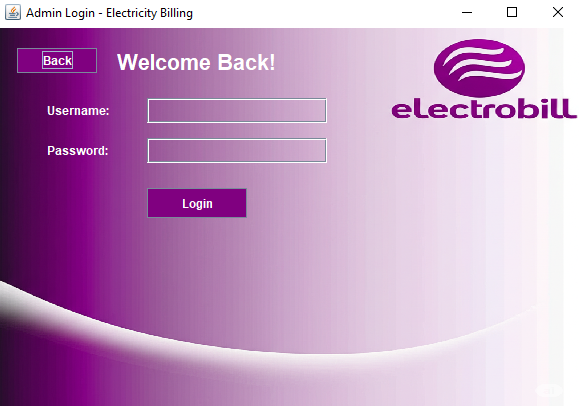
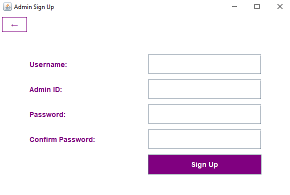

# ElectroBill - Electricity Billing System

This is a Java Swing-based Electricity Billing System. It aims to simulate a significant business flow, demonstrating a real-world use case for managing customer accounts, meters, billing, payments, and notifications.

## Features

* **Account Management:** Users can view and edit their personal details.
* **Meter Management:** Add, view, and delete meters associated with the customer account. Users can also mark a preferred meter for billing.
* **Billing Overview:** View current and historical billing information.
* **Payments:** Make payments for outstanding bills.
* **Usage History:** Track electricity consumption over time.
* **Notifications/Alerts:** Receive important updates from the system.
* **Report Generation:** Generate monthly electricity usage reports in PDF format.
* **Search and Filter:** Tables can be searched and filtered for easier data navigation.

## Screenshots

Here are some screenshots demonstrating various functionalities of the ElectroBill application:

### Homepage & Login

* **Homepage 1:**
    
* **Homepage 2:**
    
* **Customer Login:**
    
* **Customer Sign Up:**
    
* **Admin Login:**
    
* **Admin Sign Up:**
    

### Customer Dashboard

* **Account Summary:**
 View and edit personal account details.
    
    
* **Meters List:** Overview of registered meters.
  
    
    
* **Adding New Meters:** Dialog for adding a new meter.
  
    
    
* **Billing Overview:** Display of electricity bills.
  
    
    
* **Payments Panel:** Interface for making payments.
  
    
    
* **Saving Payment Receipt:**
  
    
    
* **Usage History:** Historical data of electricity consumption.

    
    
* **Notifications/Alerts:** Important system messages.
  
    

### Admin Dashboard

* **Admin Dashboard View 1:**
  
    
    
* **Admin Dashboard View 2:**
  
    

## Database Schema (Conceptual)
 
 
   
 
